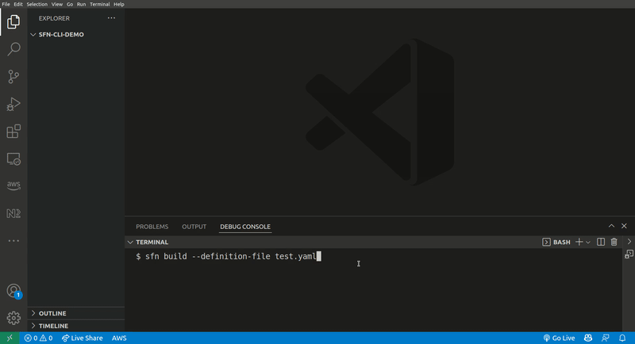
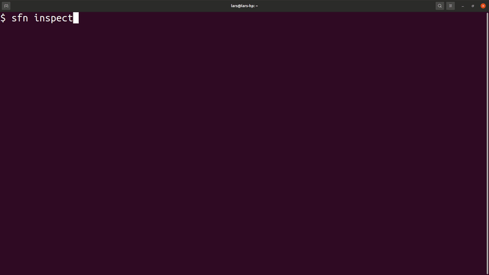

# sfn-cli

Command line interface for inspecting Amazon StepFunctions executions and building state machine definitions.

## Installation
`npm i -g @mhlabs/sfn-cli`

## Usage
```
Usage: sfn [options] [command]

Options:
  -v, --vers         output the current version
  -h, --help         display help for command

Commands:
  build|b [options]  Creates, explores and extends a StepFunctions ASL definition
  help [command]     display help for command
```

## Create / modify a state machine definition

Command: `$ sfn build --definition-file my-definition.yaml`

If the `my-definition.yaml` file doesn't exist, you will be prompted to create it. The tool will then create a skeleton of an ASL definition and guide you through creating the initial state.



## Browse and inspect state machines

Command: `$ sfn inspect`

```
Options:
  -n, --name-prefix [prefix]          Name prefix of state machine (optional) (default: "")
  -s, --status-filter [statusFilter]  Execution status filter. One of RUNNING | SUCCEEDED | FAILED | TIMED_OUT | ABORTED (optional)
  -p, --profile [profile]             AWS profile to use (default: "default")
  --region [region]                   The AWS region to use. Falls back on AWS_REGION environment variable if not specified
```



## Known issues
* Boolean logic in Choice states is not yet implemented
* By design, the tool will not guide you through adding ARNs and other parameters to SDK integrations. This is best done in a code editor.
